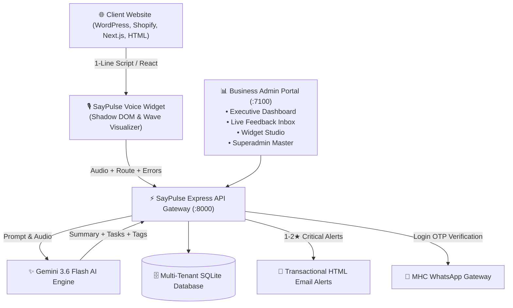

# 🎙️ SayPulse — Next-Gen AI Voice Feedback Platform

> **Turn 15 seconds of spoken customer frustration into instant, actionable product growth.**

SayPulse replaces outdated, low-context text feedback forms with an unboxed, futuristic voice widget. Using **Google Gemini 3.6 Flash AI**, it transcribes spoken audio, classifies issues, generates actionable engineering tickets, and captures full technical diagnostics in real time.

---

## 🌟 Key Features

- **🎙️ Futuristic Unboxed Voice Visualizers:** Floating mic badge with 6 fluid space visualizers:
  - *Siri Wave*, *Neural Sphere*, *Particle Ring*, *Nebula Plasma*, *Solar Ribbon*, and *Laser Horizon*.
- **⚡ Gemini 3.6 Flash AI Pipeline:**
  - Extracts 1-sentence executive summaries.
  - Automatic category classification (*Bug*, *UX Friction*, *Feature Request*, *Performance*, *General Praise*).
  - Generates concrete, actionable engineering tasks.
  - Generates 4 dynamic tone variations (*Spoken*, *Short*, *Formal*, *Elaborated*).
- **💻 Automated Diagnostic Harvesting:** Auto-captures route breadcrumbs (`/pricing` ➔ `/signup`), viewport dimensions, browser/OS, and JavaScript console stack traces.
- **🏢 Multi-Tenant Workspace Isolation:** Dynamic tenant routing (`/admin/[slug]`), dedicated production API keys (`sp_live_...`), and isolated SQLite/relational databases.
- **👑 Platform Superadmin Governance (`/admin/master`):** Holistic monitoring of all registered customer companies, global CSAT trends, and 1-click workspace switching.
- **📲 Passwordless WhatsApp OTP Login:** Integrated with **MHC WhatsApp Gateway** for secure 6-digit phone verification with 10-minute expiry and anti-replay protection.
- **📧 Transactional Email Alert Engine:** Rich HTML email alert cards dispatched immediately for 1-2★ ratings and critical bugs.
- **⚡ Universal 1-Line Embed Script:** Zero-build `<script src="..."></script>` tag with Shadow DOM isolation or native React component (`@saypulse/react`).

---

## 🏛️ System Architecture



---

## 🚀 Quick Start (Localhost Development)

### 1. Prerequisites
- Node.js 18+ or 20+
- npm / yarn / pnpm

### 2. Install Dependencies
```bash
git clone https://github.com/mandalvivek/SayPulse.git
cd SayPulse
npm install
```

### 3. Configure Environment Variables
Create `apps/api/.env`:
```env
PORT=8000
GEMINI_API_KEY=your_gemini_api_key_here
SAYPULSE_DEV_KEY=sp_dev_local_master

# MHC WhatsApp Communication Gateway
MHC_WHATSAPP_BASE_URL=https://communication-dev.myhealthchapter.com
MHC_WHATSAPP_API_KEY=your_mhc_api_key_here
```

### 4. Run Development Servers
```bash
# Start backend API (Port 8000)
npm run dev --workspace=@saypulse/api

# Start Next.js Admin & Demo portal (Port 7100)
npm run dev --workspace=@saypulse/demo
```

---

## 📁 Repository Structure

```
saypulse/
├── apps/
│   ├── api/                  # Express REST API, Gemini AI Pipeline, DB Repositories & WhatsApp Service
│   └── demo/                 # Next.js 14 App Router SaaS Platform & Multi-Tenant Admin Portal
│
├── packages/
│   ├── core/                 # Shared TypeScript models, audio recorders & PII sanitizer
│   └── react/                # React Voice Widget Component & Space Visualizers
│
├── doc/                      # Comprehensive Technical Documentation Suite
│   ├── 01_ARCHITECTURE_AND_SYSTEM_DESIGN.md
│   ├── 02_DATABASE_SCHEMA_AND_MULTI_TENANCY.md
│   ├── 03_ADMIN_PANEL_SPECIFICATION.md
│   ├── 04_WHATSAPP_GATEWAY_INTEGRATION.md
│   ├── 05_ROADMAP_AND_IMPLEMENTATION_PLAN.md
│   └── 06_FTP_DEPLOYMENT_AND_SERVER_CREDENTIALS.md
│
├── SayPulse_Business_Pitch_Deck.pdf   # 4-Page Executive B2B Pitch Deck
└── SayPulse_Pitch_Deck.html          # HTML Source for Pitch Deck
```

---

## ⚡ 1-Line Universal CDN Embed

Add this script tag right before `</body>` on any website:

```html
<script 
  src="https://cdn.saypulse.ai/v1/saypulse.min.js" 
  data-key="sp_live_your_api_key_here" 
  data-animation="siri-wave" 
  data-position="bottom-right" 
  defer>
</script>
```

---

## 📄 License & Ownership
Copyright © 2026 SayPulse AI. Created and maintained by [Vivek Mandal](https://github.com/mandalvivek).
