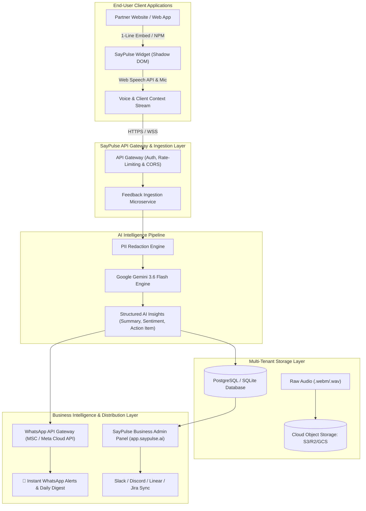

# SayPulse — Architecture & Enterprise System Design

## 1. Executive Summary

**SayPulse** is a next-generation, AI-native voice feedback platform that enables businesses to capture authentic, spoken user feedback directly within any web application, summarize it into actionable product intelligence using **Google Gemini 3.6 Flash**, and distribute insights instantly across a **Business Admin Portal** and **WhatsApp API Gateway**.

---

## 2. Core Pillars of the Platform

```
┌────────────────────────────────────────────────────────────────────────────────────────┐
│                                 SAYPULSE ECOSYSTEM                                     │
├────────────────────────────┬─────────────────────────────┬─────────────────────────────┤
│ 1. Client Embed Module     │ 2. AI Intelligence Engine   │ 3. Business Admin Panel     │
│    (SDK / <script> tag)    │    (Gemini 3.6 Pipeline)    │    (Multi-Tenant SaaS)      │
│                            │                             │                             │
│ • Unboxed Space Visualizer │ • Real-time Transcription   │ • Executive Analytics       │
│ • Web Speech & MediaStream │ • Structured Summary        │ • Live Feedback Inbox       │
│ • 3-Box Review & Tone Mod  │ • Category & Sentiment      │ • 1-Click Linear/Jira Sync  │
│ • Client Context Harvester │ • Actionable Recommendation │ • WhatsApp API Gateway      │
└────────────────────────────┴─────────────────────────────┴─────────────────────────────┘
```

---

## 3. High-Level Architecture Diagram



---

## 4. Key Subsystems & Domain Modules

### 4.1. Module 1: The Client Embed Widget (`@saypulse/core` + `@saypulse/react` + `saypulse.min.js`)
- **Distribution:** Dual distribution via **1-line `<script>` tag** (with Shadow DOM encapsulation) and **NPM package** (`@saypulse/react`).
- **Visualizer Engine:** 6 hyper-realistic unboxed space animations (*Siri Wave, Neural Sphere, Particle Ring, Nebula Plasma, Solar Ribbon, Laser Horizon*) rendered over a 240px zero-clipping canvas.
- **Context Harvester:** Automatically collects URL, user journey route history, browser/OS, viewport, and client console error stack traces without requiring manual instrumentation.
- **3-Box Review Interface:** Interactive comparison between raw transcript, Gemini summary, tone variants (*Short, Formal, Elaborated*), and actionable product recommendation.

### 4.2. Module 2: The Core API & Ingestion Engine (`apps/api`)
- **API Key & Tenant Authentication:** Header-based `X-SayPulse-Key` authentication validating domain allowlists and subscription tiers.
- **Ingestion Routes:**
  - `POST /saypulse/v1/feedback/summarize`: Gemini AI processing pipeline.
  - `POST /saypulse/v1/feedback/tone`: Multi-tone rewriting engine.
  - `POST /saypulse/v1/feedback/submit`: Multi-tenant database persistence & webhook dispatch.
  - `GET  /saypulse/v1/feedback`: Admin query endpoint with sentiment, category, and date filtering.

### 4.3. Module 3: The Business Admin Panel (`apps/admin` / `apps/dashboard`)
- **Multi-Tenant SaaS Portal:** Secure organization login (Email/Password, Magic Link, Google OAuth).
- **Executive Analytics:** Average CSAT, NPS, Sentiment breakdown (Positive/Neutral/Critical), Category distribution (Bug/UX/Feature Request/Performance), and live volume trends.
- **Feedback Inbox:** Real-time filterable feed with full drill-down modal displaying spoken transcript, AI summary, device context, user route journey, and console errors.
- **Widget Customizer:** Live preview enabling businesses to select default animation style, customize accent colors, toggle ratings, and define custom prompt questions.
- **API Key & Team Management:** Issue and revoke production/staging API keys, invite team members with role-based access control (Admin, Product Manager, Viewer).

### 4.4. Module 4: The WhatsApp API Gateway (`MSC / Meta Cloud API`)
- **Real-Time Critical Alerts:** Instant WhatsApp notification sent to business owners/stakeholders when a **1-Star rating** or **Critical Bug** is reported.
- **Daily / Weekly Voice Digest:** AI-compiled summary of overall feedback sentiment, top friction points, and customer quotes sent directly on WhatsApp.
- **Interactive Action Buttons:** Direct WhatsApp buttons (`[View Details]`, `[Mark Resolved]`, `[Open Ticket]`).

---

## 5. Security, Privacy & Data Compliance

1. **Client-Side PII Redaction:** Automatic stripping of phone numbers, email addresses, credit cards, and SSNs before audio/text transcripts leave the browser.
2. **Multi-Tenant Isolation:** Database records strictly partitioned by `organization_id` and validated against cryptographically signed `api_key` tokens.
3. **Encrypted Audio Storage:** Voice recordings encrypted at rest (AES-256) with configurable data retention policies (7 days, 30 days, 90 days, or instant purge).
4. **CORS & Origin Hardening:** Strict domain matching ensuring API keys are only utilized on verified customer domains.
