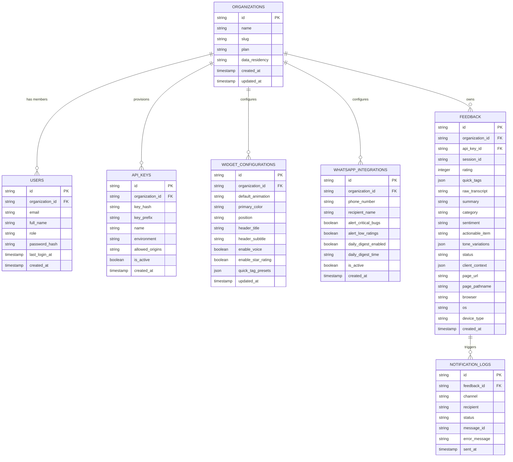

# SayPulse — Database Schema & Multi-Tenancy Design

## 1. Overview

The SayPulse data model is engineered for **multi-tenant isolation**, high-performance analytics indexing, and seamless integration with external notification channels (WhatsApp, Slack, Jira).

---

## 2. Entity-Relationship Diagram (ERD)



---

## 3. Detailed Table Specifications

### 3.1. `organizations`
Represents a business customer / tenant utilizing SayPulse.
```sql
CREATE TABLE organizations (
    id              VARCHAR(36) PRIMARY KEY,
    name            VARCHAR(255) NOT NULL,
    slug            VARCHAR(100) UNIQUE NOT NULL,
    plan            VARCHAR(50) NOT NULL DEFAULT 'starter', -- 'starter', 'pro', 'enterprise'
    data_residency  VARCHAR(50) NOT NULL DEFAULT 'us-east', -- 'us-east', 'eu-central', 'in-south'
    created_at      TIMESTAMP WITH TIME ZONE DEFAULT CURRENT_TIMESTAMP,
    updated_at      TIMESTAMP WITH TIME ZONE DEFAULT CURRENT_TIMESTAMP
);
```

### 3.2. `users`
Team members with dashboard access.
```sql
CREATE TABLE users (
    id              VARCHAR(36) PRIMARY KEY,
    organization_id VARCHAR(36) NOT NULL REFERENCES organizations(id) ON DELETE CASCADE,
    email           VARCHAR(255) UNIQUE NOT NULL,
    full_name       VARCHAR(255) NOT NULL,
    role            VARCHAR(50) NOT NULL DEFAULT 'admin', -- 'owner', 'admin', 'member', 'viewer'
    password_hash   TEXT,
    avatar_url      TEXT,
    last_login_at   TIMESTAMP WITH TIME ZONE,
    created_at      TIMESTAMP WITH TIME ZONE DEFAULT CURRENT_TIMESTAMP
);
CREATE INDEX idx_users_org ON users(organization_id);
```

### 3.3. `api_keys`
API tokens provisioned for website embedding.
```sql
CREATE TABLE api_keys (
    id              VARCHAR(36) PRIMARY KEY,
    organization_id VARCHAR(36) NOT NULL REFERENCES organizations(id) ON DELETE CASCADE,
    key_hash        VARCHAR(128) UNIQUE NOT NULL,
    key_prefix      VARCHAR(20) NOT NULL, -- e.g. 'sp_live_xxxx'
    name            VARCHAR(100) NOT NULL DEFAULT 'Production Key',
    environment     VARCHAR(20) NOT NULL DEFAULT 'production', -- 'production', 'staging', 'development'
    allowed_origins JSONB NOT NULL DEFAULT '["*"]'::jsonb,
    is_active       BOOLEAN NOT NULL DEFAULT TRUE,
    created_at      TIMESTAMP WITH TIME ZONE DEFAULT CURRENT_TIMESTAMP
);
CREATE INDEX idx_api_keys_org ON api_keys(organization_id);
CREATE INDEX idx_api_keys_hash ON api_keys(key_hash);
```

### 3.4. `feedback`
The central store for all customer feedback, AI structured summaries, and device metrics.
```sql
CREATE TABLE feedback (
    id              VARCHAR(36) PRIMARY KEY,
    organization_id VARCHAR(36) NOT NULL REFERENCES organizations(id) ON DELETE CASCADE,
    api_key_id      VARCHAR(36) REFERENCES api_keys(id) ON DELETE SET NULL,
    session_id      VARCHAR(100),
    rating          SMALLINT CHECK (rating >= 1 AND rating <= 5),
    quick_tags      JSONB DEFAULT '[]'::jsonb,
    raw_transcript  TEXT NOT NULL,
    summary         TEXT NOT NULL,
    category        VARCHAR(50), -- 'Bug', 'UX_Friction', 'Feature_Request', 'Performance', 'Billing', 'General_Praise'
    sentiment       VARCHAR(30), -- 'Positive', 'Neutral', 'Frustrated', 'Critical'
    actionable_item TEXT,
    tone_variations JSONB DEFAULT '{}'::jsonb,
    status          VARCHAR(30) NOT NULL DEFAULT 'new', -- 'new', 'in_review', 'actioned', 'resolved', 'ignored'
    client_context  JSONB, -- Full captured technical context (console errors, route history, viewport)
    page_url        TEXT,
    page_pathname   TEXT,
    browser         VARCHAR(100),
    os              VARCHAR(100),
    device_type     VARCHAR(30), -- 'mobile', 'tablet', 'desktop'
    audio_s3_url    TEXT,
    created_at      TIMESTAMP WITH TIME ZONE DEFAULT CURRENT_TIMESTAMP
);
CREATE INDEX idx_feedback_org_created ON feedback(organization_id, created_at DESC);
CREATE INDEX idx_feedback_category ON feedback(organization_id, category);
CREATE INDEX idx_feedback_sentiment ON feedback(organization_id, sentiment);
CREATE INDEX idx_feedback_rating ON feedback(organization_id, rating);
```

### 3.5. `widget_configurations`
Customizable branding and animation settings per organization.
```sql
CREATE TABLE widget_configurations (
    id                  VARCHAR(36) PRIMARY KEY,
    organization_id     VARCHAR(36) UNIQUE NOT NULL REFERENCES organizations(id) ON DELETE CASCADE,
    default_animation   VARCHAR(50) NOT NULL DEFAULT 'siri-wave', -- 'siri-wave', 'neural-sphere', 'particle-ring', 'nebula-plasma', 'solar-ribbon', 'laser-horizon'
    primary_color       VARCHAR(20) NOT NULL DEFAULT '#06B6D4',
    position            VARCHAR(20) NOT NULL DEFAULT 'bottom-right', -- 'bottom-right', 'bottom-left'
    header_title        VARCHAR(100) NOT NULL DEFAULT "How's your experience? 🎯",
    header_subtitle     VARCHAR(100) NOT NULL DEFAULT 'Tap a star to rate',
    enable_voice        BOOLEAN NOT NULL DEFAULT TRUE,
    enable_star_rating  BOOLEAN NOT NULL DEFAULT TRUE,
    quick_tag_presets   JSONB DEFAULT '["Bug / Error", "Slow / Laggy", "Confusing UI", "Missing Feature"]'::jsonb,
    updated_at          TIMESTAMP WITH TIME ZONE DEFAULT CURRENT_TIMESTAMP
);
```

### 3.6. `whatsapp_integrations`
Configuration for instant alerts and executive digests via WhatsApp API.
```sql
CREATE TABLE whatsapp_integrations (
    id                  VARCHAR(36) PRIMARY KEY,
    organization_id     VARCHAR(36) NOT NULL REFERENCES organizations(id) ON DELETE CASCADE,
    phone_number        VARCHAR(30) NOT NULL, -- E.164 format: +1234567890
    recipient_name      VARCHAR(100) NOT NULL,
    alert_critical_bugs BOOLEAN NOT NULL DEFAULT TRUE,
    alert_low_ratings   BOOLEAN NOT NULL DEFAULT TRUE, -- Rating <= 2 stars
    daily_digest_enabled BOOLEAN NOT NULL DEFAULT FALSE,
    daily_digest_time   VARCHAR(10) DEFAULT '09:00',
    is_active           BOOLEAN NOT NULL DEFAULT TRUE,
    created_at          TIMESTAMP WITH TIME ZONE DEFAULT CURRENT_TIMESTAMP
);
CREATE INDEX idx_whatsapp_org ON whatsapp_integrations(organization_id);
```

### 3.7. `notification_logs`
Delivery status audit trail for WhatsApp and Webhook dispatches.
```sql
CREATE TABLE notification_logs (
    id              VARCHAR(36) PRIMARY KEY,
    feedback_id     VARCHAR(36) REFERENCES feedback(id) ON DELETE CASCADE,
    channel         VARCHAR(30) NOT NULL, -- 'whatsapp', 'slack', 'email', 'webhook'
    recipient       VARCHAR(255) NOT NULL,
    status          VARCHAR(30) NOT NULL, -- 'sent', 'delivered', 'read', 'failed'
    message_id      VARCHAR(255),
    error_message   TEXT,
    sent_at         TIMESTAMP WITH TIME ZONE DEFAULT CURRENT_TIMESTAMP
);
CREATE INDEX idx_notif_feedback ON notification_logs(feedback_id);
```
