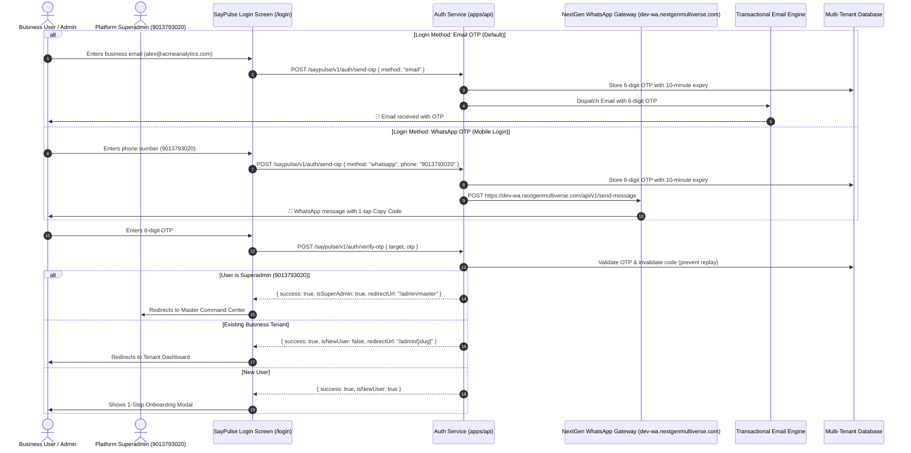

# SayPulse — NextGen WhatsApp Gateway & Login OTP Specification

## 1. Overview & Architectural Role

In the SayPulse enterprise ecosystem, **NextGen WhatsApp Communication Gateway** is dedicated exclusively to **Authentication & Passwordless Login OTP**. 

All operational notifications, critical bug alerts, and executive digests are strictly dispatched via **Email**, ensuring complete work-life separation and zero spam compliance risk.

---

## 2. Gateway Endpoints & Network Topology

| Environment | Base Gateway URL | Admin Management Portal |
|---|---|---|
| **Development / Staging** | `https://dev-wa.nextgenmultiverse.com` | `https://dev-wa.nextgenmultiverse.com/admin` |
| **Production** | `https://wa.nextgenmultiverse.com` | `https://wa.nextgenmultiverse.com/admin` |

- **HTTP Method:** `POST`
- **Path:** `/api/v1/send-message`
- **Headers:**
  - `x-api-key: <YOUR_MHC_API_KEY>`
  - `Content-Type: application/json`

---

## 3. Authentication Flow Architecture



---

## 4. WhatsApp OTP Message Format

```
🔐 *SayPulse Login Verification*

Your One-Time Password (OTP) is: *{{OTP}}*

⏰ _Valid for 10 minutes. Do not share this code with anyone for security._
```

---

## 5. Security & Rate Limiting Controls

1. **Anti-Replay Invalidation:** Once verified, the OTP is instantly purged from memory.
2. **Anti-Brute Force:** Max 5 incorrect OTP verification attempts allowed before automatic invalidation.
3. **Anti-Spam Dispatch Throttling:** 30-second cooldown between OTP requests per phone number.
4. **Phone Sanitization:** Automatic international prefixing (`91` for Indian numbers) ensuring correct Baileys routing.
