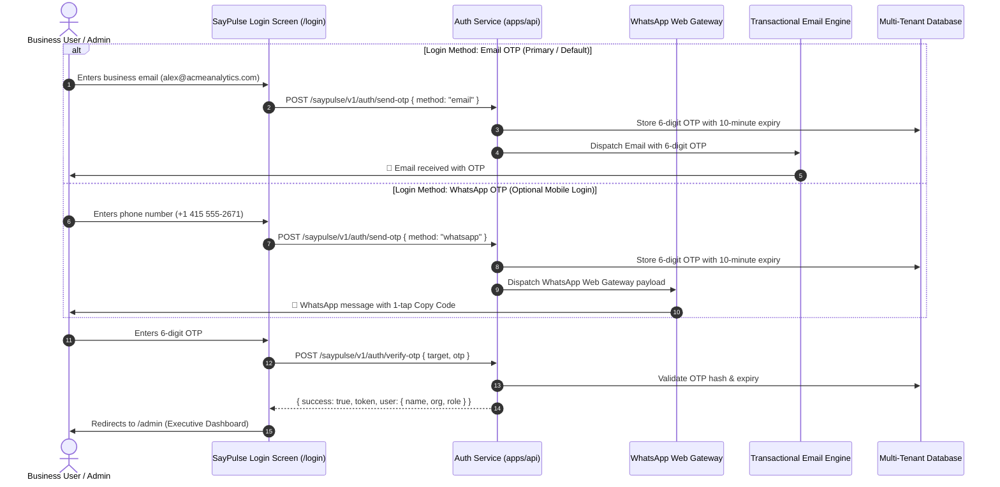

# SayPulse — WhatsApp Web Gateway & Login OTP Specification

## 1. Overview & Architectural Role

In the SayPulse enterprise ecosystem, **WhatsApp Web Gateway** is dedicated exclusively to **Authentication & Passwordless Login OTP**. 

All operational notifications, critical bug alerts, and executive digests are strictly dispatched via **Email**, ensuring complete work-life separation and zero spam compliance risk.

---

## 2. Authentication Flow Architecture



---

## 3. WhatsApp OTP Message Format

When a user initiates login via phone number, the WhatsApp Web Gateway dispatches the following pre-approved authentication message:

```
🔐 *SayPulse Login Verification Code*

Your 6-digit authentication code is:
*749 201*

This code expires in 10 minutes. For security, never share this code with anyone.

─────────────────────────
[ 📋 Copy Code ]
```

---

## 4. WhatsApp Web Gateway Technical Integration

### 4.1. Gateway API Request (`POST /api/send-otp`)
- **Endpoint:** `http://localhost:8000/saypulse/v1/auth/send-otp`
- **Payload:**
```json
{
  "method": "whatsapp",
  "phone": "+14155552671"
}
```

### 4.2. Gateway Response
```json
{
  "success": true,
  "method": "whatsapp",
  "target": "+14155552671",
  "expiresInSeconds": 600,
  "message": "Verification code dispatched via WhatsApp Web Gateway."
}
```

### 4.3. OTP Verification Request (`POST /api/verify-otp`)
```json
{
  "target": "+14155552671",
  "otp": "749201"
}
```
- **Verification Response:**
```json
{
  "success": true,
  "token": "sp_jwt_session_token_xyz987",
  "user": {
    "id": "user_admin_01",
    "email": "alex@acmeanalytics.com",
    "name": "Alex Rivera",
    "role": "owner",
    "organization": {
      "id": "org_acme_analytics_master",
      "name": "Acme Analytics",
      "plan": "enterprise"
    }
  }
}
```

---

## 5. Security & Rate Limiting Controls

1. **Anti-Brute Force:** Max 5 incorrect OTP verification attempts allowed per session before invalidation.
2. **Dispatch Throttling:** Max 1 OTP dispatch allowed every 60 seconds per email/phone number.
3. **Cryptographic Salt & Expiry:** OTPs are stored with SHA-256 hash digests and strictly auto-expire after 600 seconds (10 minutes).
